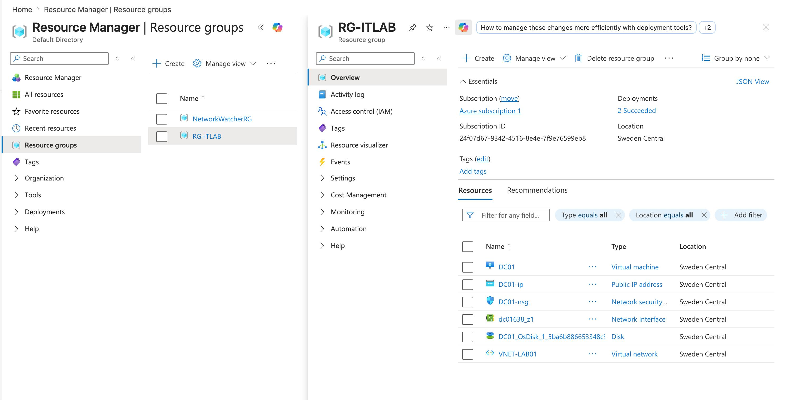
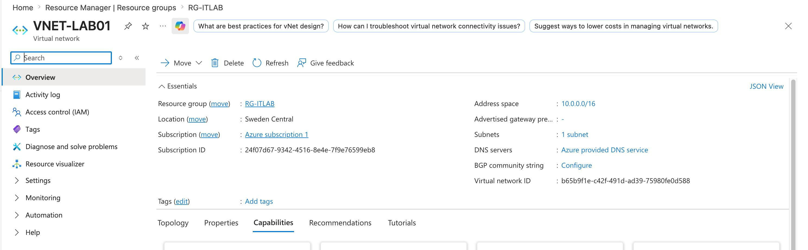
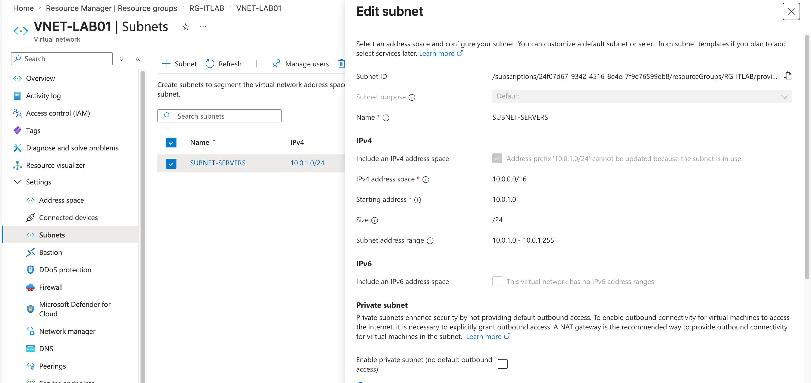
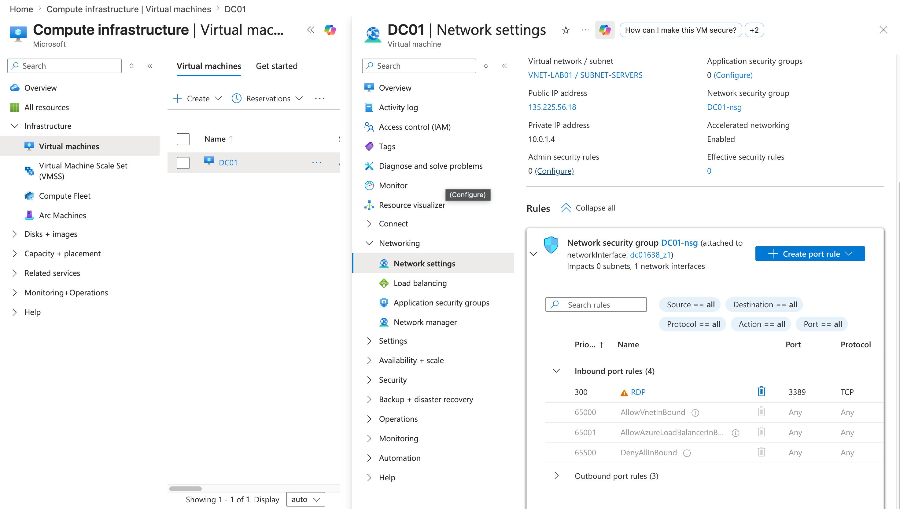
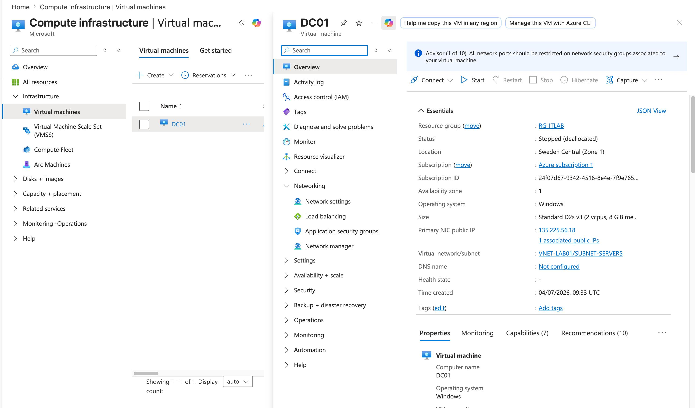
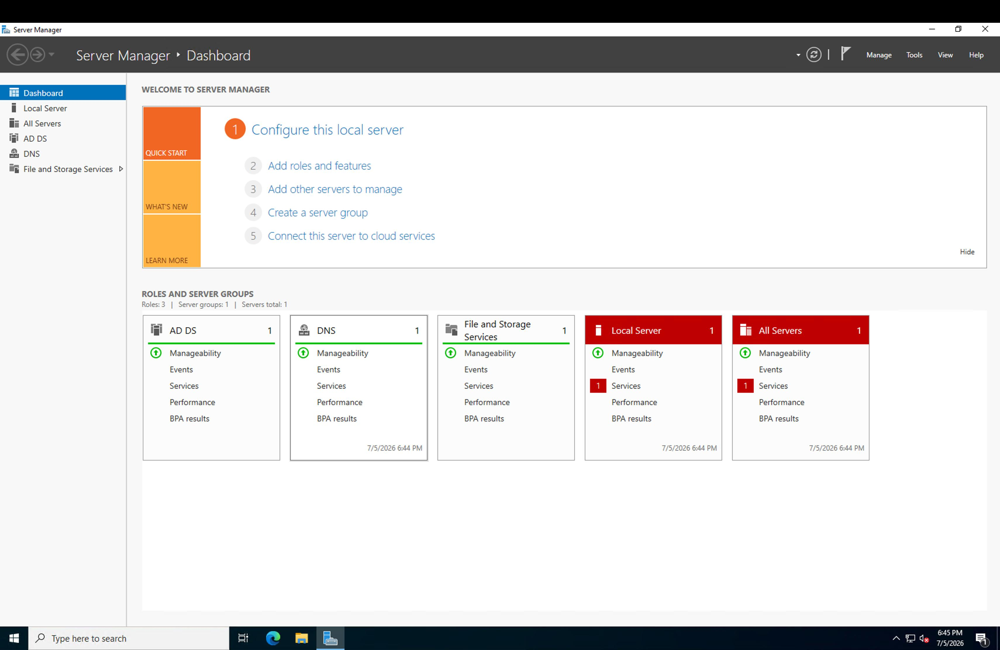

# Project 01 - Azure Infrastructure

## Overview

This project establishes the foundational Microsoft Azure infrastructure for the Enterprise Windows Infrastructure Lab. The environment is designed to simulate a real-world enterprise deployment by creating the core cloud resources required to host Windows Server workloads and support future services such as Active Directory, DNS, DHCP, Group Policy, and File Services.

---

# Objectives

- Create an Azure Resource Group
- Deploy a Virtual Network
- Configure a dedicated subnet
- Secure the environment using a Network Security Group (NSG)
- Deploy a Windows Server 2022 virtual machine
- Verify remote administration using Remote Desktop Protocol (RDP)

---

# Environment

| Component | Configuration |
|-----------|---------------|
| Cloud Platform | Microsoft Azure |
| Operating System | Windows Server 2022 Datacenter |
| Resource Group | RG-LAB01 |
| Virtual Network | VNET-LAB01 |
| Subnet | SUBNET-SERVERS |
| Network Security Group | NSG-LAB01 |
| Virtual Machine | DC01 |
| Remote Access | Remote Desktop Protocol (RDP) |

> **Note:** Replace the resource names above with your actual Azure resource names if they differ.

---

# Architecture

The Azure environment consists of a dedicated Resource Group containing a Virtual Network with a server subnet. A Windows Server 2022 virtual machine is protected by a Network Security Group and accessed remotely using Remote Desktop Protocol (RDP). This virtual machine will later be promoted to a Domain Controller and host additional enterprise services throughout this lab series.

---

# Deployment

## 1. Azure Resource Group

A dedicated Resource Group was created to logically organize all Azure resources associated with this project. Resource Groups simplify administration, monitoring, and lifecycle management of cloud resources.

---

## 2. Virtual Network

A Virtual Network was deployed to provide secure private networking for the enterprise environment. This network will host all future servers and client machines deployed throughout the lab.

---

## 3. Subnet

A dedicated subnet was configured to host Windows Server infrastructure. Network segmentation improves organization and provides flexibility for future expansion.

---

## 4. Network Security Group

A Network Security Group (NSG) was configured to control inbound and outbound traffic. During deployment, Remote Desktop Protocol (TCP 3389) was allowed to enable secure remote administration.

---

## 5. Windows Server 2022 Virtual Machine

A Windows Server 2022 Datacenter virtual machine was deployed as the first server within the Azure environment. This server will serve as the foundation for Active Directory Domain Services (AD DS), DNS, DHCP, Group Policy, and File Services in later projects.

---

## 6. Remote Desktop Verification

A successful Remote Desktop (RDP) connection confirmed that the Windows Server virtual machine was operational and ready for enterprise configuration.

---

# Validation

The deployment was successfully validated by confirming:

- Resource Group creation
- Virtual Network deployment
- Subnet configuration
- Network Security Group association
- Windows Server virtual machine deployment
- Successful Remote Desktop connectivity

---

# Enterprise Best Practices

- Use dedicated Resource Groups to organize related resources.
- Apply consistent naming conventions across Azure resources.
- Design network architecture before deploying virtual machines.
- Restrict inbound access using Network Security Groups.
- Build infrastructure with scalability and future services in mind.

---

# Skills Demonstrated

- Microsoft Azure Administration
- Azure Resource Group Management
- Virtual Network Configuration
- Network Security Group Administration
- Windows Server 2022 Deployment
- Remote Desktop Administration
- Infrastructure Documentation

---

# Lessons Learned

This project provided practical experience deploying core Azure infrastructure that serves as the foundation for an enterprise Windows environment. Understanding how Azure networking, security, and virtual machines integrate is essential before implementing higher-level services such as Active Directory and enterprise identity management.

---

# Next Project

**Project 02 – Enterprise Active Directory**

The next project will build on this Azure infrastructure by promoting the Windows Server virtual machine to a Domain Controller and implementing:

- Active Directory Domain Services (AD DS)
- Organizational Units (OUs)
- Users and Security Groups
- DNS Integration
- Home Folders
- SMB File Shares
- PowerShell Automation