# Project 04 - Enterprise Group Policy Management

## Overview

This project demonstrates the implementation and management of Microsoft Group Policy Objects (GPOs) within an Active Directory domain. Enterprise policies were created to centrally manage security, desktop configuration, user environment, drive mapping, folder redirection, Windows Update settings, and software restriction policies.

The deployment follows enterprise administration best practices by separating policies into dedicated Group Policy Objects linked to the domain.

---

# Objectives

- Configure enterprise password policies
- Create custom Group Policy Objects
- Deploy desktop wallpaper policies
- Restrict USB storage devices
- Configure network drive mapping
- Implement Folder Redirection
- Configure Windows Update policies
- Implement Software Restriction Policies
- Validate policy deployment using GPUpdate and GPResult

---

# Environment

| Component | Configuration |
|-----------|---------------|
| Operating System | Windows Server 2022 Datacenter |
| Domain | corp.novatech.local |
| Domain Controller | DC01 |
| Management Tool | Group Policy Management Console (GPMC) |
| Validation | gpupdate, gpresult |

---

# Group Policy Management

## Group Policy Management Console

The Group Policy Management Console (GPMC) was used to create, configure, and manage enterprise Group Policy Objects.

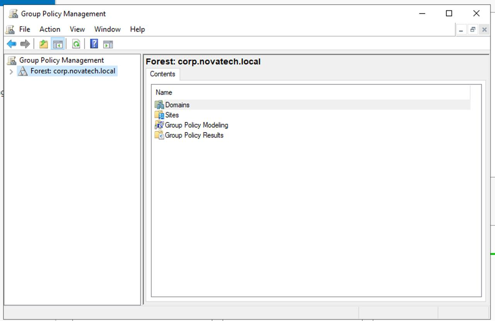

---

## Default Domain Policy

The Default Domain Policy was used to configure enterprise password policies.

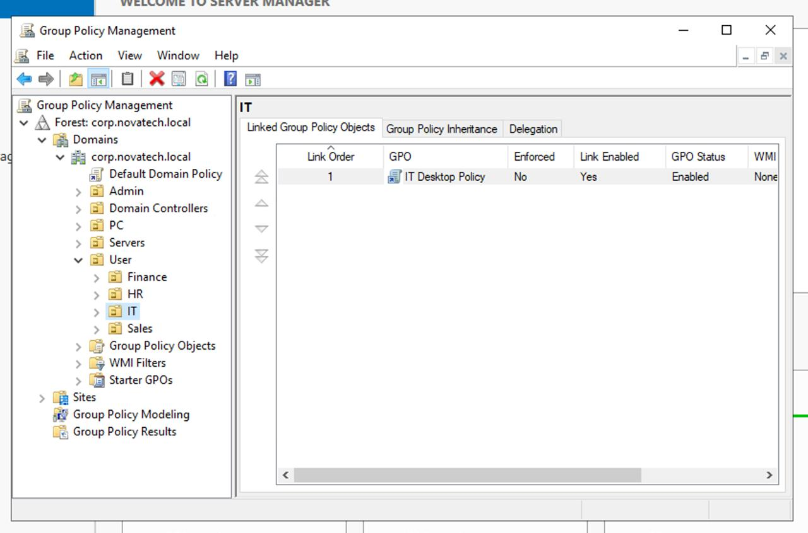

---

# Password Policy

The domain password policy was configured with enterprise security settings including:

- Password Complexity
- Minimum Password Length
- Password History
- Password Age

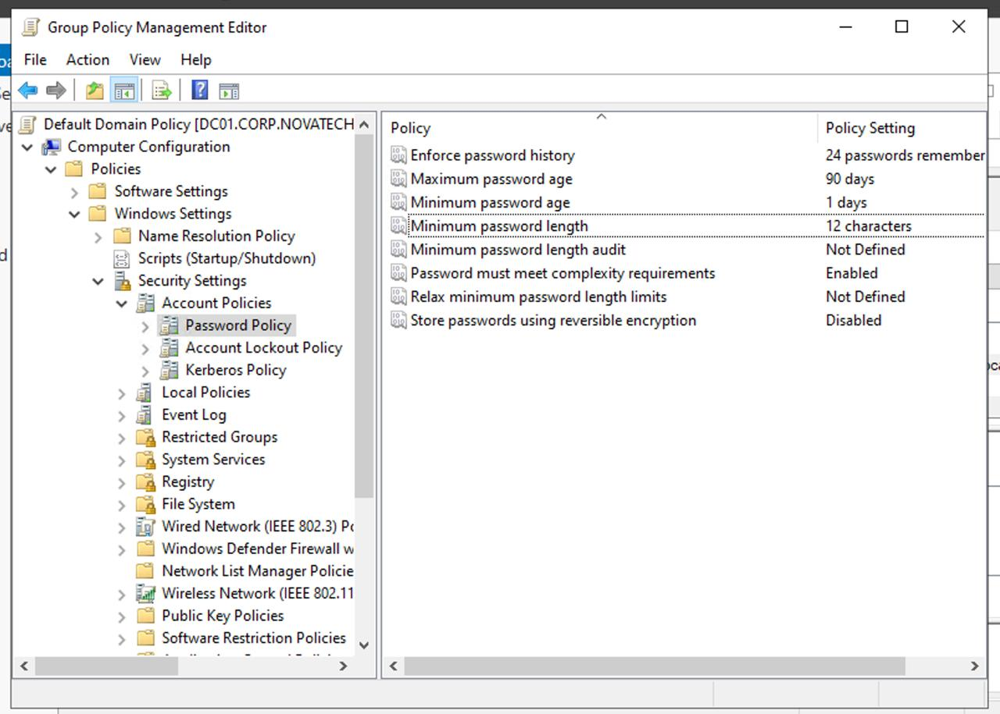

---

# Desktop Configuration

## Corporate Desktop Policy

A dedicated Group Policy Object was created to manage desktop settings.

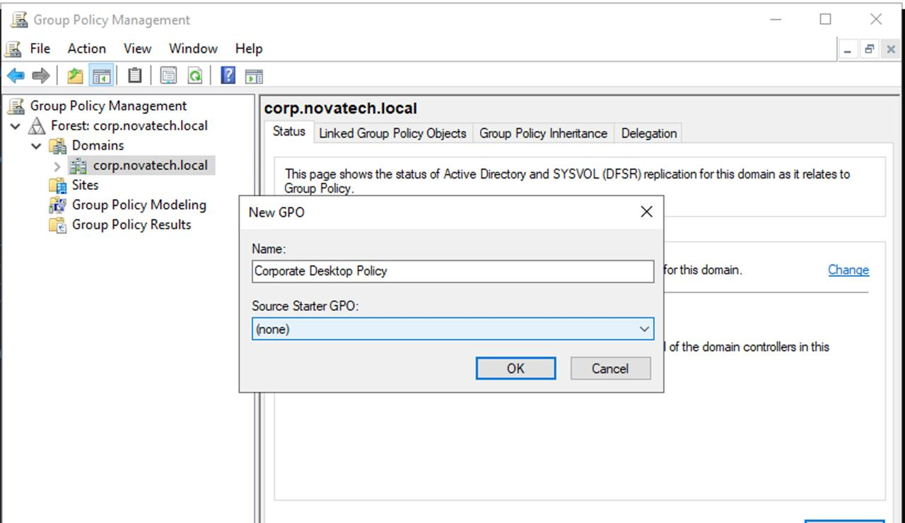

---

## Desktop Wallpaper Policy

A corporate desktop wallpaper policy was configured and deployed.

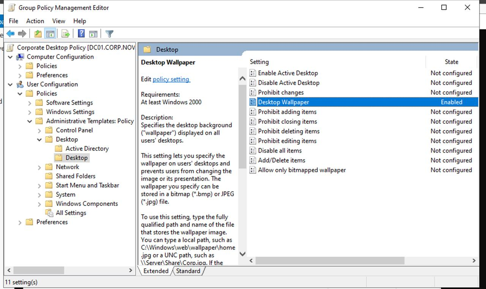

---

## Policy Update

Policies were refreshed using GPUpdate.

```cmd
gpupdate /force
```


---

# USB Storage Restriction

USB removable storage devices were restricted using Administrative Templates.

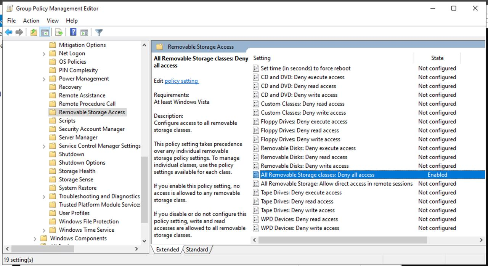

---

## Policy Update

```cmd
gpupdate /force
```

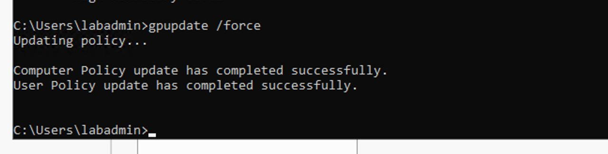

---

# Drive Mapping

A dedicated Group Policy Object was created to automatically map enterprise shared drives.

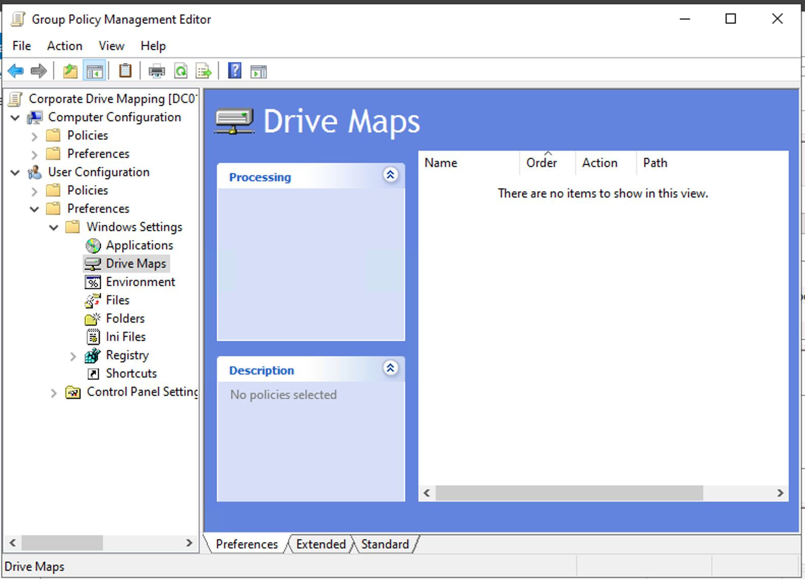

---

## Drive Map Properties

The mapped network drive configuration was configured using Group Policy Preferences.

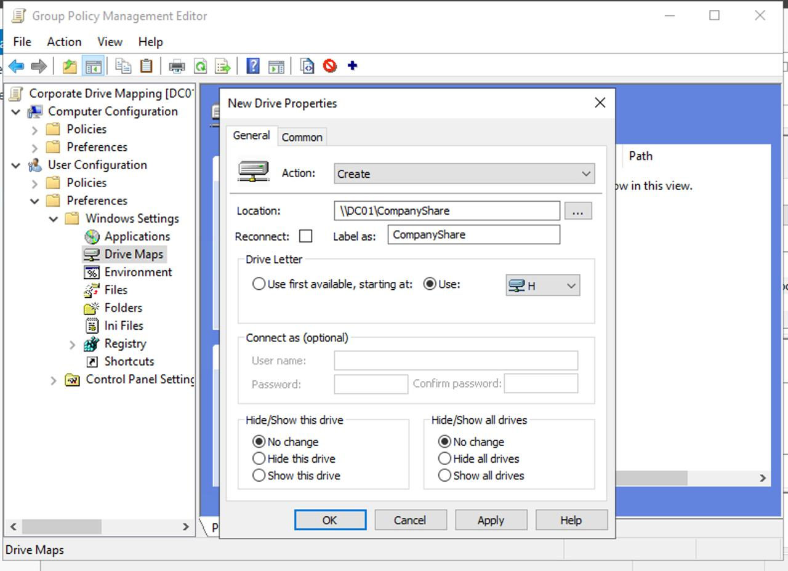

---

# Folder Redirection

A Folder Redirection policy was configured to centrally store user Documents folders on the file server.

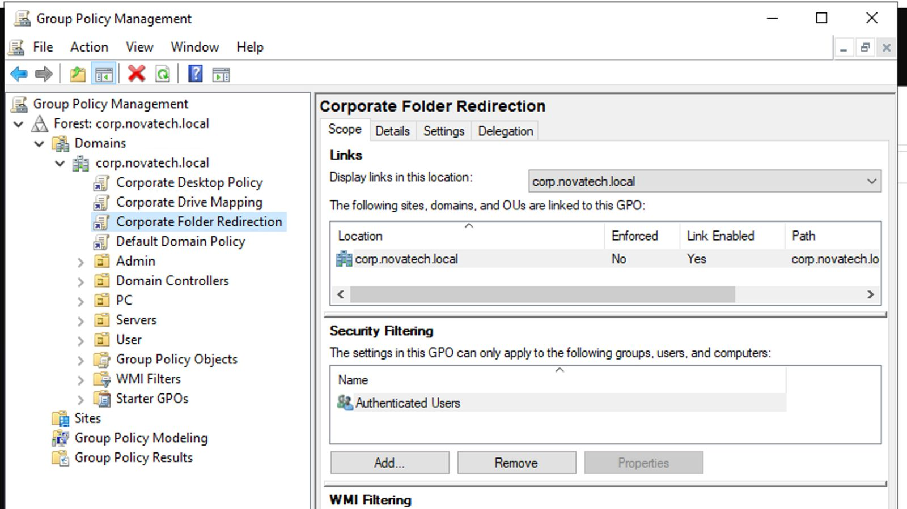

---

## Folder Redirection Settings

The policy redirects each user's Documents folder to a centralized network location.

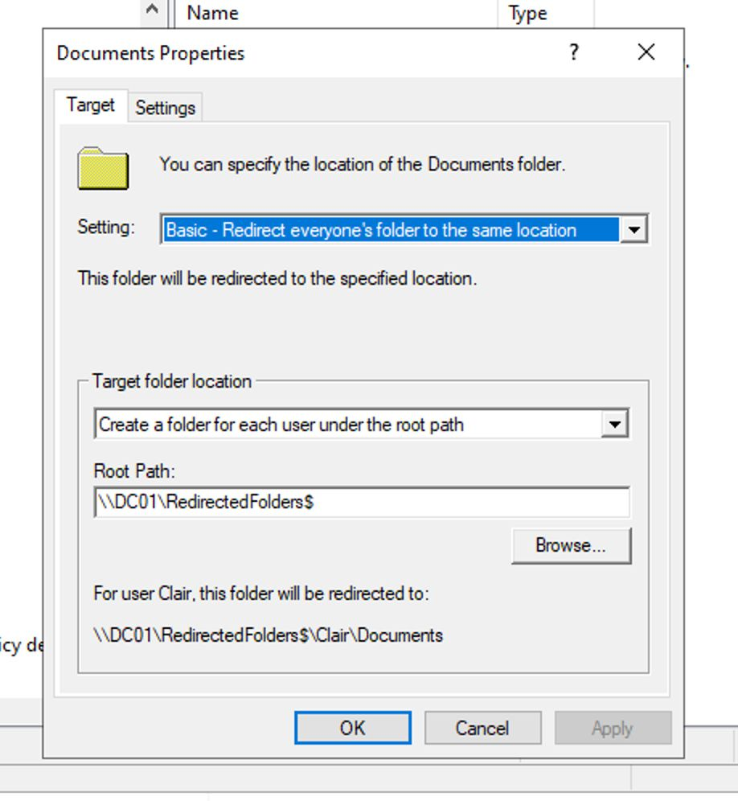

---

# Windows Update Policy

A dedicated Windows Update Group Policy Object was created.

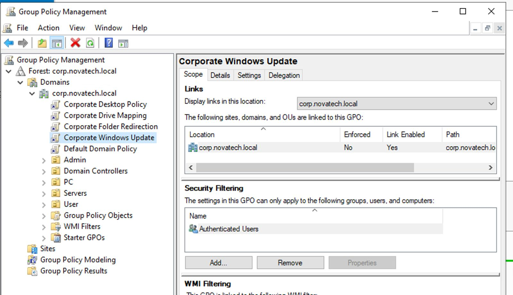

---

## Automatic Updates

Automatic Windows Updates were configured using enterprise policy settings.

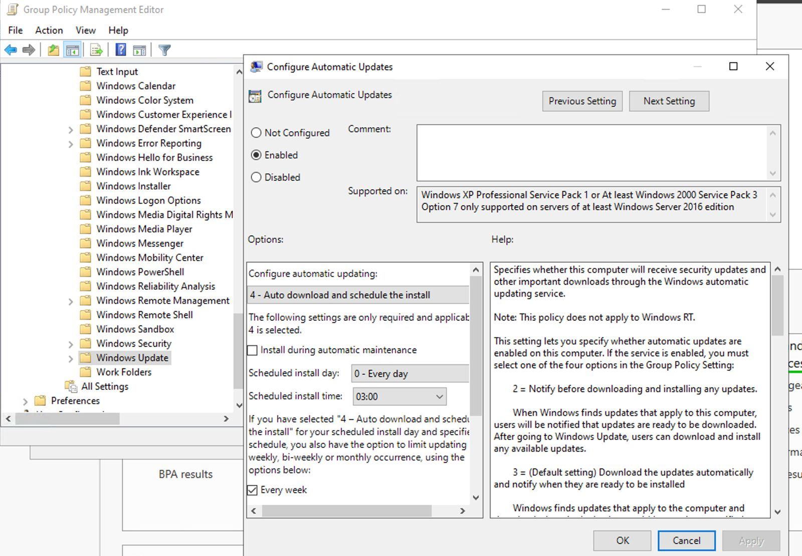

---

# Software Restriction Policies

Software Restriction Policies were created to improve endpoint security.

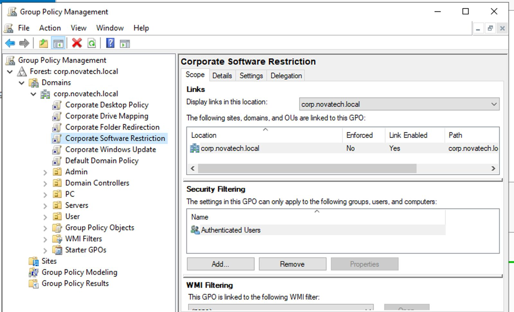

---

## Default Security Levels

Default Security Levels were configured for Software Restriction Policies.

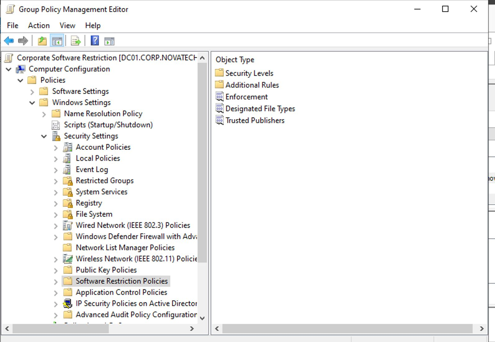

---

# Policy Validation

## GPUpdate

All configured Group Policies were refreshed using:

```cmd
gpupdate /force
```


---

## GPResult

Applied Group Policies were verified using:

```cmd
gpresult /r
```

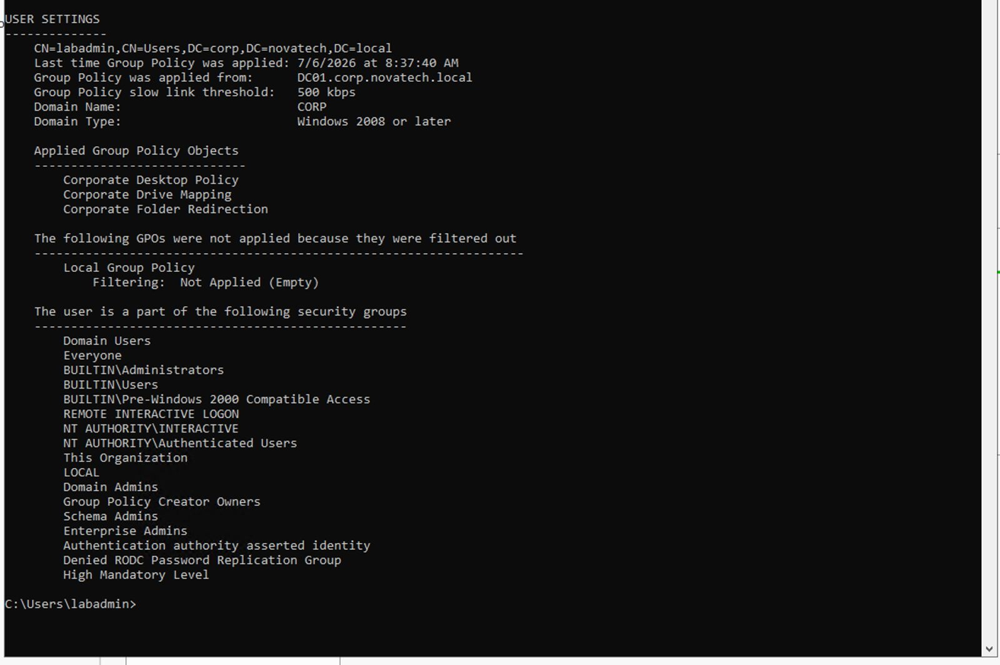

---

# Validation

The Group Policy deployment was successfully validated by confirming:

- Password Policy configuration
- Desktop Wallpaper deployment
- USB Storage Restriction
- Drive Mapping configuration
- Folder Redirection
- Windows Update policy configuration
- Software Restriction Policies
- Successful Group Policy refresh
- Successful policy reporting with GPResult

---

# Skills Demonstrated

- Active Directory Group Policy
- Windows Server Administration
- Enterprise Security Configuration
- Password Policy Management
- Desktop Standardization
- Drive Mapping
- Folder Redirection
- Windows Update Management
- Software Restriction Policies
- PowerShell & Command-Line Administration
- Enterprise Infrastructure Management

---

# Lessons Learned

This project demonstrates how Group Policy provides centralized management for Windows enterprise environments. By separating policies into dedicated Group Policy Objects, administrators can simplify management, improve security, and consistently enforce organizational standards across domain-joined computers and users.

---

# Next Project

## Project 05 – Enterprise File Services

The next project focuses on implementing enterprise file services including:

- Shared Folders
- NTFS Permissions
- Share Permissions
- Hidden Shares
- Access-Based Enumeration (ABE)
- Shadow Copies
- File Server Resource Manager (FSRM)
- Disk Quotas
- File Screening
- Storage Reports