# Project 09 - Windows Server Security Hardening

## Overview

This project demonstrates the implementation and verification of essential Windows Server security hardening measures. It covers account lockout policies, auditing, Microsoft Defender configuration, Windows Firewall, Remote Desktop security, SMB configuration, local administrator verification, security event monitoring, and Windows Update compliance.

The project follows enterprise security best practices commonly performed by IT Support Engineers, System Administrators, and Security Operations Center (SOC) analysts.

---

# Objectives

- Configure account lockout policies
- Verify account policy enforcement
- Configure Windows auditing
- Verify Microsoft Defender configuration
- Configure Windows Firewall
- Secure Remote Desktop
- Review SMB server configuration
- Verify local administrator membership
- Monitor Windows security events
- Verify Windows security updates

---

# Environment

| Component | Configuration |
|-----------|---------------|
| Server | Windows Server 2022 |
| Client | Windows 11 Pro |
| Domain | enterprise.local |
| Tools | Group Policy Management, Windows Defender, Windows Firewall, Event Viewer, PowerShell |

---

# Project Structure

```text
09-Windows-Server-Security-Hardening
│
├── README.MD
└── Screenshots
```

---

# Lab 1 – Configure Account Lockout Policy

Configured domain account lockout settings using Group Policy.

### Screenshot

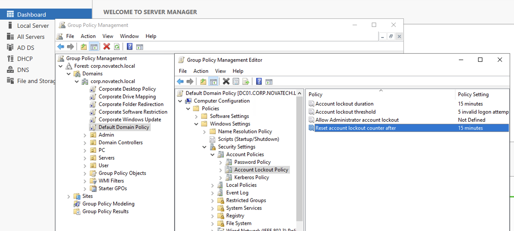

---

# Lab 2 – Validate Account Lockout Policy

Verified that the configured account lockout policy was successfully applied.

### Screenshot

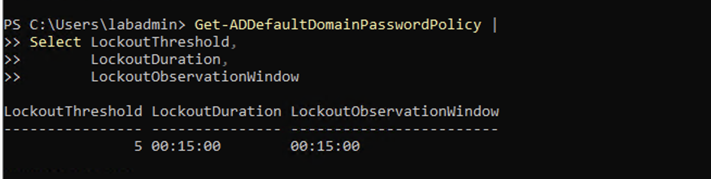

---

# Lab 3 – Configure Credential Auditing

Verified audit policy for credential validation.

### Screenshot

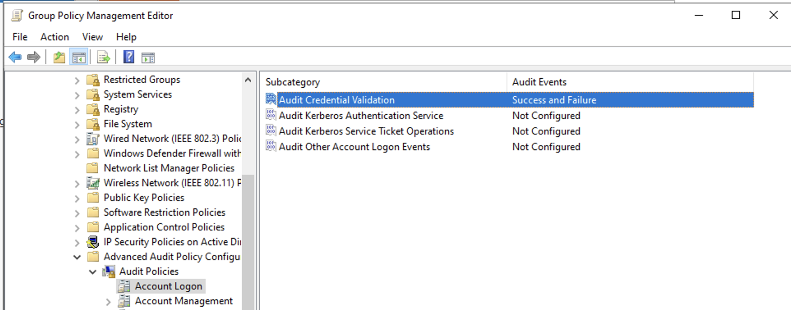

---

# Lab 4 – Configure Logon Auditing

Verified audit policy for logon events.

### Screenshot

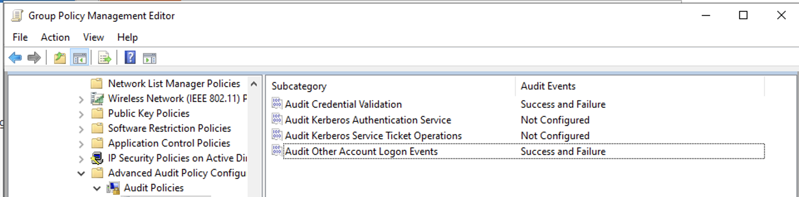

---

# Lab 5 – Configure User Account Management Auditing

Verified auditing of user account management activities.

### Screenshot

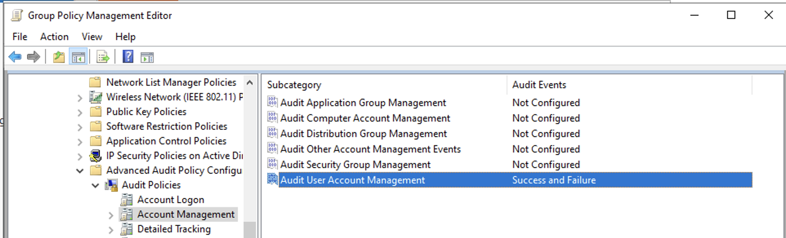

---

# Lab 6 – Configure Audit Policy Change

Verified auditing of security policy changes.

### Screenshot

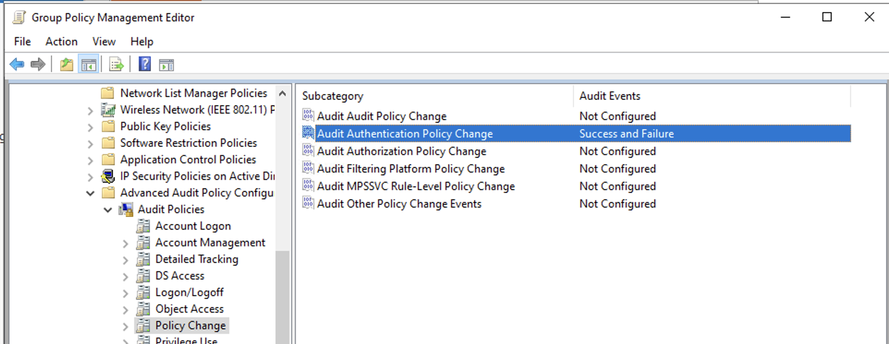

---

# Lab 7 – Force Group Policy Update

Applied the latest Group Policy settings.

### Screenshot

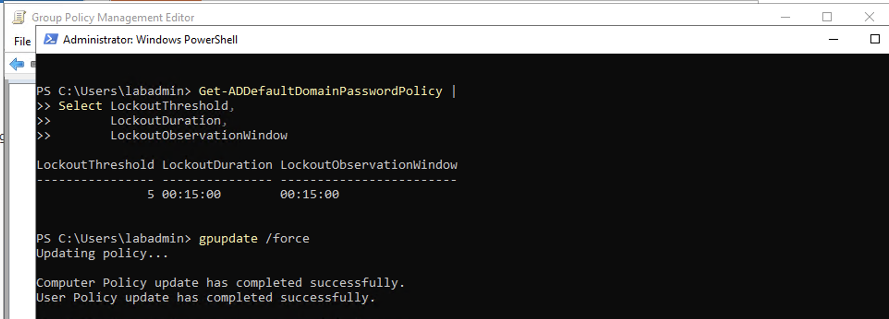

---

# Lab 8 – Validate Audit Policy

Confirmed that all configured audit policies were successfully applied.

### Screenshot

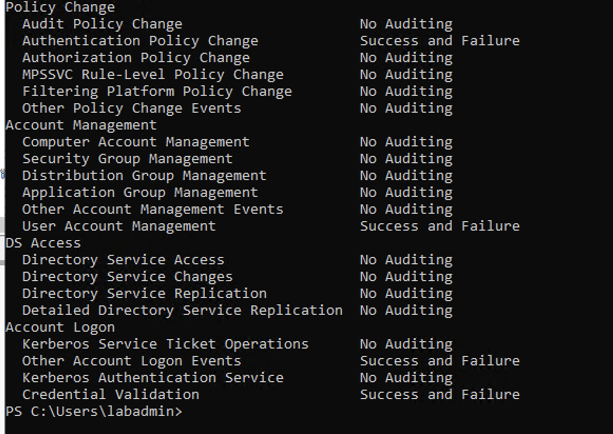

---

# Lab 9 – Microsoft Defender Status

Verified Microsoft Defender Antivirus operational status.

### Screenshot

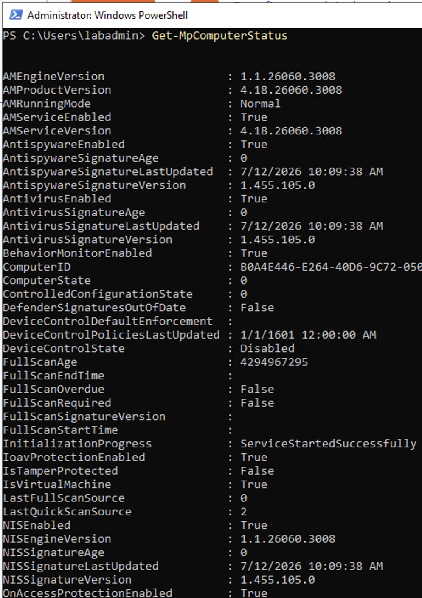

---

# Lab 10 – Microsoft Defender Preferences

Reviewed Microsoft Defender configuration and protection settings.

### Screenshot

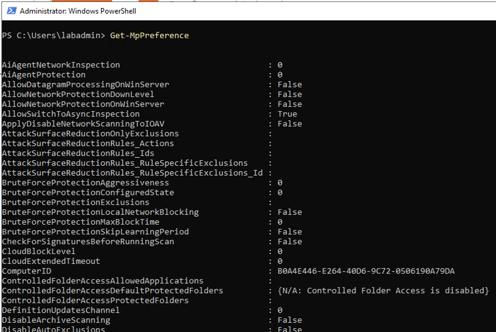

---

# Lab 11 – Microsoft Defender Signatures

Verified antivirus signature version and update status.

### Screenshot

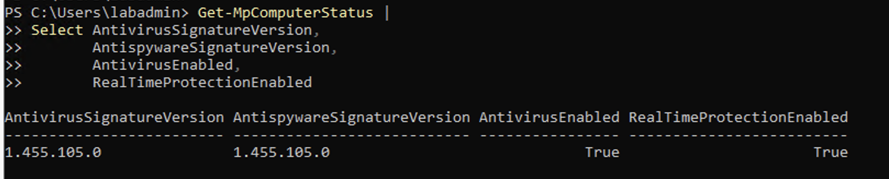

---

# Lab 12 – Windows Firewall Profiles

Verified Domain, Private, and Public firewall profiles.

### Screenshot

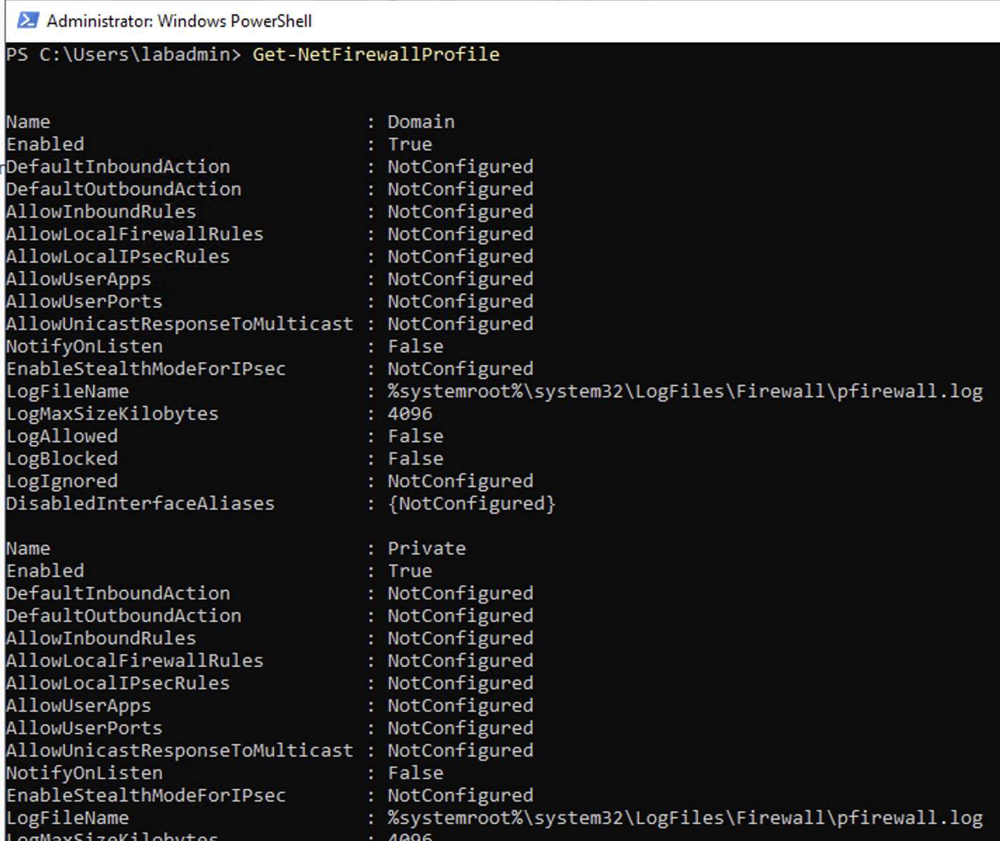

---

# Lab 13 – Windows Firewall Rules

Reviewed configured inbound and outbound firewall rules.

### Screenshot

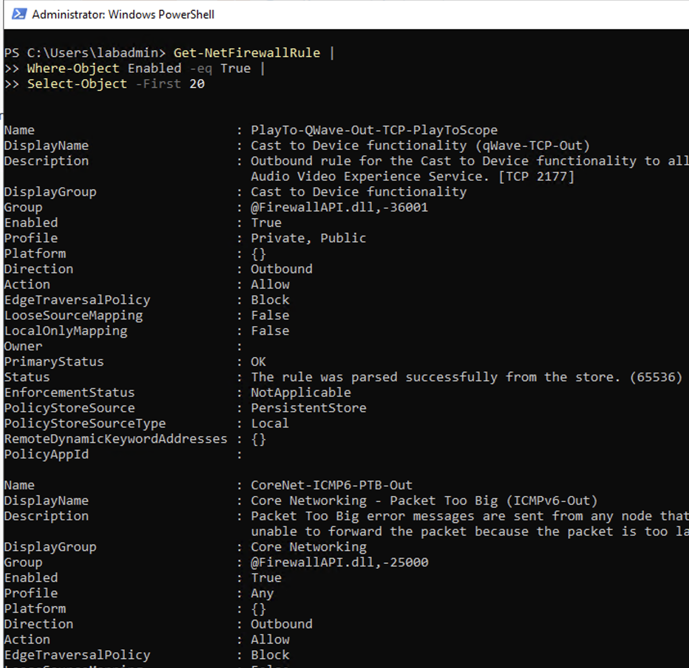

---

# Lab 14 – Remote Desktop Security

Verified Remote Desktop configuration and security settings.

### Screenshot

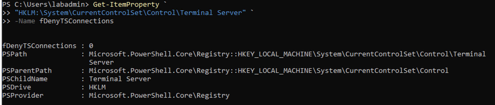

---

# Lab 15 – Remote Desktop Firewall Rules

Verified Windows Firewall rules permitting Remote Desktop access.

### Screenshot

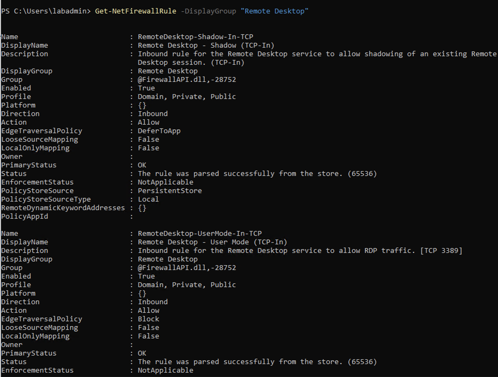

---

# Lab 16 – SMB Server Configuration

Reviewed SMB server security configuration.

### Screenshot

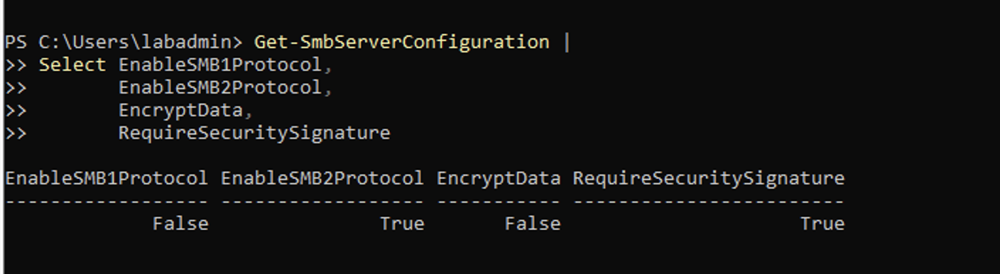

---

# Lab 17 – Local Administrators Group

Verified members of the local Administrators group.

### Screenshot

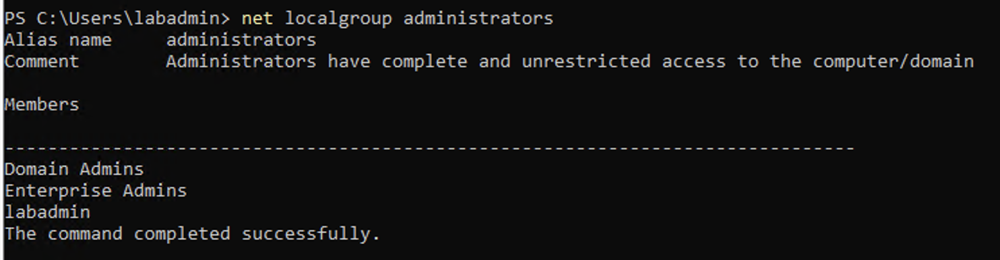

---

# Lab 18 – Security Event Log

Reviewed Windows Security event logs for authentication and audit events.

### Screenshot

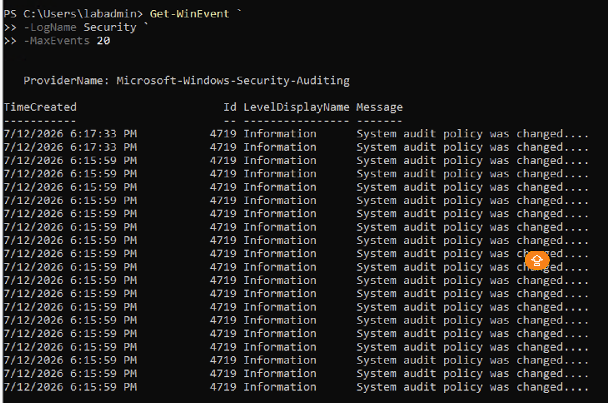

---

# Lab 19 – Installed Security Updates

Verified installed Windows security updates.

### Screenshot

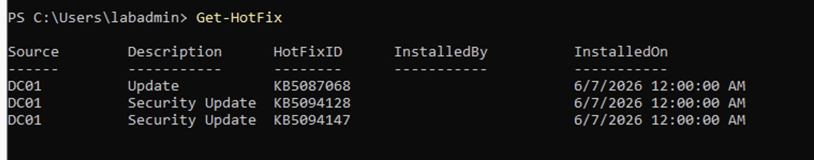

---

# Skills Demonstrated

- Windows Server Security Hardening
- Group Policy Security Configuration
- Account Lockout Policy Management
- Windows Auditing
- Microsoft Defender Administration
- Windows Firewall Administration
- Remote Desktop Security
- SMB Security Configuration
- Security Event Monitoring
- Windows Update Verification
- Enterprise Security Best Practices

---

# Lessons Learned

This project demonstrates the implementation and verification of core Windows Server security controls used in enterprise environments. By configuring account policies, auditing, endpoint protection, firewall settings, remote access security, and update management, the project establishes a secure baseline aligned with enterprise security best practices.

---

# Next Project

## Repository 2 – Enterprise Network Analysis

Continue with advanced network protocol analysis using Wireshark, beginning with **Project 01 – Wireshark Fundamentals**, followed by TCP, DNS, DHCP, HTTP/HTTPS, SMB, RDP, ICMP, and Nmap traffic analysis.
